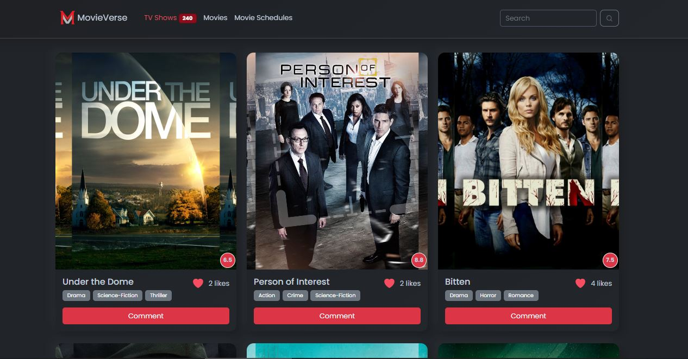
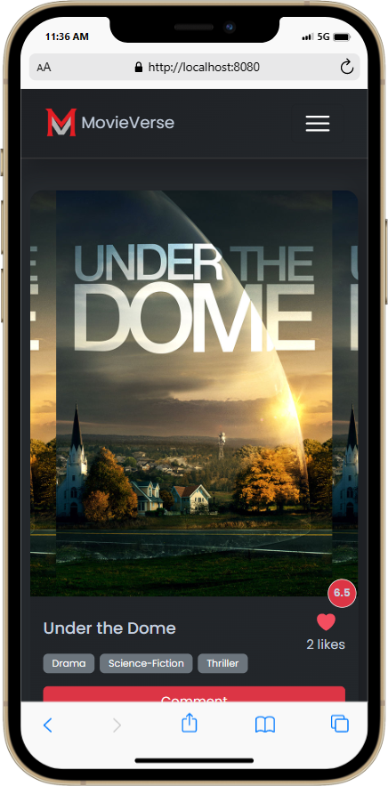

<div align="center">
  
  <h1><b>Movieverse</b></h1>

</div>

<!-- TABLE OF CONTENTS -->

# 📗 Table of Contents

- [📖 About the Project](#about-project)
  - [🛠 Screenshots](#screenshots)
  - [🛠 Built With](#built-with)
    - [Tech Stack](#tech-stack)
    - [Key Features](#key-features)
  - [🚀 Live Demo](#live-demo)
- [💻 Getting Started](#getting-started)
  - [Setup](#setup)
  - [Prerequisites](#prerequisites)
  - [Install](#install)
  - [Usage](#usage)
  - [Deployment](#deployment)
- [👥 Authors](#authors)
- [🔭 Future Features](#future-features)
- [🤝 Contributing](#contributing)
- [⭐️ Show your support](#support)
- [🙏 Acknowledgements](#acknowledgements)
- [📝 License](#license)

<!-- PROJECT DESCRIPTION -->

# 📖 Movieverse <a name="about-project"></a>

Movieverse curates mvoies to movie lovers; they can see, search, comment, and see ratings of their favourite movies. A full responsive website developed using webpack and ES6 Syntax

## 🛠 Screenshots <a name="screenshots"></a>




## 🛠 Built With <a name="built-with"></a>

### Tech Stack <a name="tech-stack"></a>

- **Html 5**
- **CSS 3**
- **Webpack 5**
- **Bootstrap 5**

### Key Features <a name="key-features"></a>

- **List movies**
- **Show movie details**
- **Add likes and comments to movies**
- **Search movies**

<p align="right">(<a href="#readme-top">back to top</a>)</p>

## 🚀 Live Demo <a name="live-demo"></a>

- Here is the link to the live demo version - [Movieverse](https://adamilare.github.io/javascript-capstone/dist)

<p align="right">(<a href="#readme-top">back to top</a>)</p>

## 💻 Getting Started <a name="getting-started"></a>

To get a local copy up and running, follow these steps.

### Prerequisites <a name="prerequisites">

In order to run this project you need:

### Setup <a name="setup">

Clone this repository to your desired folder:

```sh
  cd my-project-folder
  git clone https://github.com/adamilare/javascript-capstone.git
```

-

### Install <a name="install">

Install this project with:

Example command:

```sh
  cd javascript-capstone
  npm install
```

-

### Usage <a name="usage">

To run the project, execute the following command:

```sh
  npm run start
```

### Deployment <a name="deployment">

You can deploy this project using:

Example:

```sh
 vercel or gh-pages
```

<p align="right">(<a href="#readme-top">back to top</a>)</p>

## 👥 Authors <a name="authors"></a>

👤 **Stephen Addae**

- GitHub: [@Stephen-Adom](https://github.com/Stephen-Adom)
- Twitter: [@stephen_alaska](https://twitter.com/stephen_alaska)
- LinkedIn: [Stephen Addae](https://www.linkedin.com/in/stephen-addae-a32334154/)

👤 **Damilare Adepoju**

- GitHub: [@githubhandle](https://github.com/adamilare)
- Twitter: [@twitterhandle](https://twitter.com/mailtodare)
- LinkedIn: [LinkedIn](https://linkedin.com/in/adamilare)
- GitUp Page: [My Page](https://adamilare.github.io/)

<p align="right">(<a href="#readme-top">back to top</a>)</p>

## 🔭 Future Features <a name="future-features"></a>

- [ ] **Authentication**

<p align="right">(<a href="#readme-top">back to top</a>)</p>

## 🤝 Contributing <a name="contributing"></a>

Contributions, issues, and feature requests are welcome!

Feel free to check the [issues page](../../issues/).

<p align="right">(<a href="#readme-top">back to top</a>)</p>

## ⭐️ Show your support <a name="support"></a>

If you like this project please give me a star⭐

<p align="right">(<a href="#readme-top">back to top</a>)</p>

## 🙏 Acknowledgments <a name="acknowledgements"></a>

We are grateful to Microverse Inc that provided the guidelines for this project

<p align="right">(<a href="#readme-top">back to top</a>)</p>

## 📝 License <a name="license"></a>

This project is [MIT](./LICENSE) licensed.

<p align="right">(<a href="#readme-top">back to top</a>)</p>
